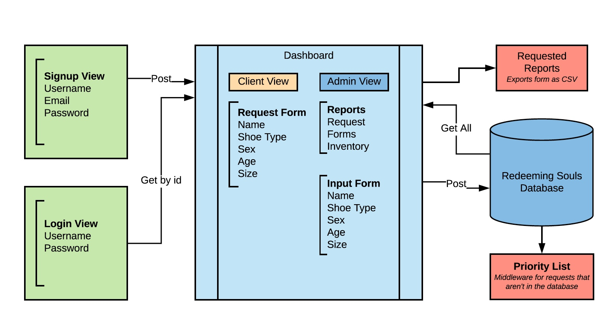

# Redeeming Soles | No Kids Left on the Sidelines

### Index
- [Overview](#overview)
- [Getting Started](#getting-started)
- [Using this application](#using-this-application)
- [Password requirements](#password-requirements)
- [Change Log](#change-log)

# Overview
This is the first iteration of a web application for the Redeeming Soles "No Kids Left on the Sidelines" 
project. The mission is to provide for children who are in need of sports shoes but do not have the 
ability to obtain them. This application is designed to track incoming sport shoes/cleats requests from coaches and youth 
sports leagues.  This application aids in keeping an accurate inventory of sports shoes and prioritizes fulfillment of in-house requests first.

## Getting Started
To visit the site, please click [here](https://redeeming-soles-front.herokuapp.com/). 
Sign in using the intuitive interface to either request shoes for your youth sports team or 
league. To do so you will need a valid username and password. In Admin view, higher privileges are enabled allowing Redeeming Soles' volunteers to manage inbound shoe donations. 

## Password Requirements
A user's password must include at least one of each of the following requirements. 
- 6 characters
- 1 lowercase letter
- 1 uppercase letter
- 1 number
- 1 special character

## Using The Application
A requesting coach or league official will sign up or login to the website.  Once logged in, the 
user will be able to make the needed shoe requests for their athletes.  If the user is a 
Redeeming Soles administrator, the site will be directed to the admin screen which will allow the
 user to add donated shoes into the "No Kids Left on the Sidelines" shoe inventory.

## Architecture

This front end application utilized the following dependencies for it's creation.

| Dependencies |  | |
| --- | --- | --- |
| babel-core | babel-eslint  | babel-loader |
| babel-plugin-transform-react-jsx-source | babel-preset-env | babel-preset-react |
| babel-preset-stage-0 | clean-webpack-plugin | css-loader |
| dotenv | enzyme | enzyme-adapter-react-16 |
| eslint | eslint-config-airbnb-base | eslint-plugin-import |
| eslint-plugin-jest | eslint-plugin-react | html-webpack-exclude-empty-assets-plugin |
| html-webpack-plugin | jest | mini-css-extract-plugin |
| node-sass | prop-types | react |
| react-dom | react-redux | react-router-dom |
| react-test-renderer | redux | redux-mock-store |
| sass-loader | style-loader | superagent |
| uuid | validator | webpack |
|webpack-cli | webpack-dev-server | webpack-merge|
| express |||

## Testing
This application utilized the [Jest](https://facebook.github.io/jest/en/) testing suite. This allows for both unit testing individual features and integration testing for newly added features. The test driven development methodology of red green testing was used to ensure once features worked there would be no regression of the current code base. 

## Credits and Collaborations
A special THANK YOU to Melanie Downing, Seth Donahue, Vinicio Sanchez for their expertise and 
guidance through this project.  Thank you to the Code Fellows staff, TA's and fellow 401d23 students!
